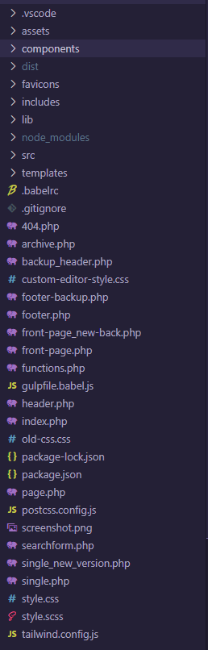

# Certilytics Corporate Website

This repo contains the wordpress theme for the certilytics corporate website.

Was built on top of the previous theme.

## Project Structure



### assets

This directory contains assets from the previous theme (some are still in use).

### components

In this directory lives all the "components" that are used to create the new pages 
in order to have a better separation of concerns and cleaner code.

### dist

This directory is used to store the compiled assets, php templates and js code in order to feed the server and it's managed by the bundler (gulp).

### includes

This directory contains some building blocks for old pages.

### lib 

This directory contains previous version of javascript bundle, some of the code is still in use.

### src
This directory contains the new assets for the new version of the theme (styles, js and images).

### templates

Here are the templates for the new pages, which are using the files from the components directory, each template is related to different pages.

### Other important files

- **Header.php:** This file contains the navigation bar and the `<head>` tag that contains code related to analytics.

- **Footer.php:** This file contains the markup for the footer of the corporate page.

- **Front-page.php:** This file contains the code that represents the index or homepage for the wordpress theme.

- **single_new_version.php:** This file is used to update or change the posts template.

## Commands

Installs dependencies.
```
$ npm install   
```
 Runs in development mode requires XAMPP for local develompent and a wordpress installation 
```
$ npm start     
```

Generates the zip theme file certilytics.zip and this is used in dev, staging and prod.  
The generated file lives under `./packaged/`
```
$ npm run bundle 
```
